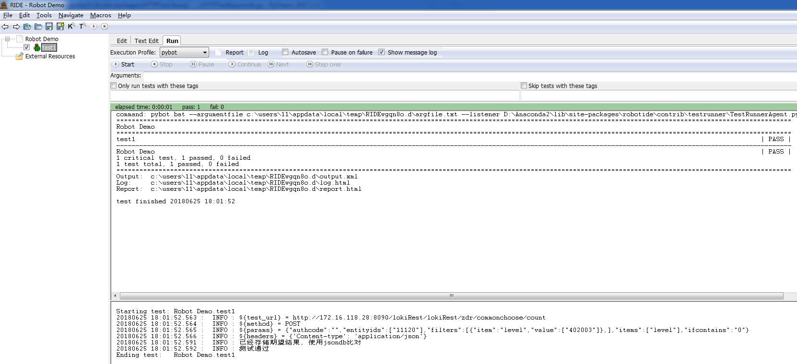

# HTTPTestLibrary

> RobotFramework的HTTP接口测试关键词库

## 设计思路如下：

#### 通常接口测试活动都包含如下步骤：

1. 梳理接口测试文档
2. 编写接口测试用例（接口的URL、输入参数、**测试数据**、**期望结果**等）
3. 转为自动化用例（依次填写输入参数、**期望结果**、放入**测试数据**、清理**测试数据**）
4. 调试
5. 投产
6. 维护文字用例和自动化用例

这是一种循环。

#### 经常遇到的问题有哪些：

1. 没有清晰的接口文档、或文档没更新，更甚者没有文档；
2. 写好的文字用例还要转为自动化用例，这个过程存大量的重复copy工作，没有产生有效价值，是对人创造力的摧残；
3. 后期维护艰难，维护了文字用例还要转一份测试代码，测试代码越来越多，堪比一个颇具规模的项目代码，心力憔悴，最终放弃使用；
4. 构造测试数据比较耗时；

#### 接口测试可不可以这样做？

1. 不需要研发提供接口测试文档，我们可以通过研发的代码注解生成接口测试所需的信息；
2. 不需要维护文字用例+代码用例，只要写一份配置文件描述用例即可方便的阅读，同时也可以运行自动化测试；
3. 用户在编写用例时不需要重复的填写期望结果，框架辅助提供期望结果，用户只需对自动生成的期望结果进行微调审核确认即可快速得到期望结果；
4. 提供快速生成期望测试数据的插件支撑。
5. 接口自动化测试用例还能同时支持**性能回归测试**。

**目前的构思如下：**

1. 通过与研发达成约定，研发在接口按照OpenAPI规范添加注解，可以通过Swagger直接生成JSON/YAML格式的接口定义文档，这样我们能随研发代码的变更拿到最新的接口定义文档；
2. 框架根据测试用例描述文件自动生成可执行的自动化代码，无需编写代码，降低上手门槛；
3. 框架只提供用例加载和运行的功能，与业务用例解耦，业务配置用例由用户负责；
4. 对具有**幂等性**的接口的同一参数进行多次重复请求（前提是此接口功能正确），自动比对生成期望结果，期望结果包含“随机变值”、“因果定值”，用户只需要审核期望结果是否正确或手动微调即可，同时会监控感知用户的审核行为，避免用户对此功能的滥用；
5. 使用随机生成数据的API服务，根据配置文件生成期望的测试数据；
6. 接口功能测试使用requests的“http客户端”，性能回归测试使用“locust客户端”调用locust框架，同时忽略功能用例的细节，只校验接口状态码。

上述功能特性会作为一个RobotFramework的第三方库的形式开发，进行接口测试只要导入关键字即可。


## 使用方式

### 安装

下载代码，将本项目命名为`HTTPTestLibrary`放入Python的site-packages目录即可

### 使用

```
*** Settings ***
Library           HTTPTestLibrary

*** Test Cases ***
test1
    ${test_url}    Set variable    http://localhost:8001/api/v1/fakerfactory
    ${method}    Set variable    GET
    ${params}    Set variable    {"number": 1, "columns": "name,age,job"}
    ${headers}    Set variable    {"Content-type": "application/json"}
    ${expect_data}    Set variable    {"data":{"count":1,"records":[{"age":22,"job":"{IGNORE}","name":"小明"}]},"status":{"code":"0","status":"ok"}}
    ${expect_data_type}    Set variable    json
    Do Test    ${method}    ${test_url}    ${expect_data}    ${expect_data_type}    params=${params}
```

忽略比对的值，设定为"{IGNORE}"

### 运行效果



